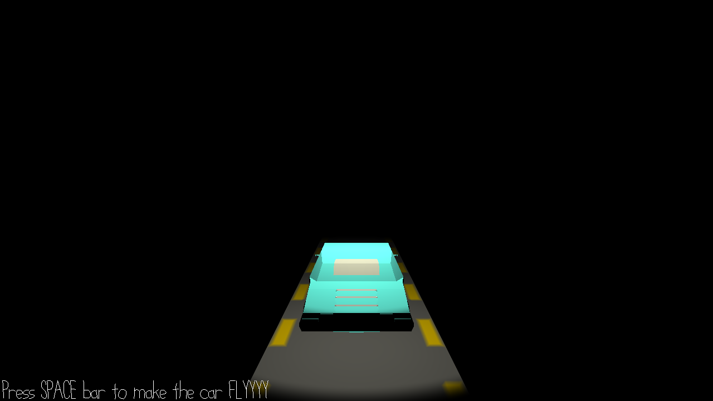

# Jumpy Car at Night

Author: Tianrun Ke

Design: The sound would indicate when the obstacle would come. Press space to jump the car to avoid crash.

Screen Shot:

How To Play:

Press space to make the car jump. You can also use A/W/D to control the rotation of the car. (it's a deprecated feature because I'm running out of time)

Sources: 

*OBB Collision detection(I wasted a lot of time understanding how it works, but didn't end up using it much): https://math.stackexchange.com/questions/62633/orthogonal-projection-of-a-point-onto-a-line
https://gamedev.stackexchange.com/questions/25397/obb-vs-obb-collision-detection.

*Sound asset: https://freesound.org/people/Moulaythami/sounds/530587/.

This game was built with [NEST](NEST.md).

